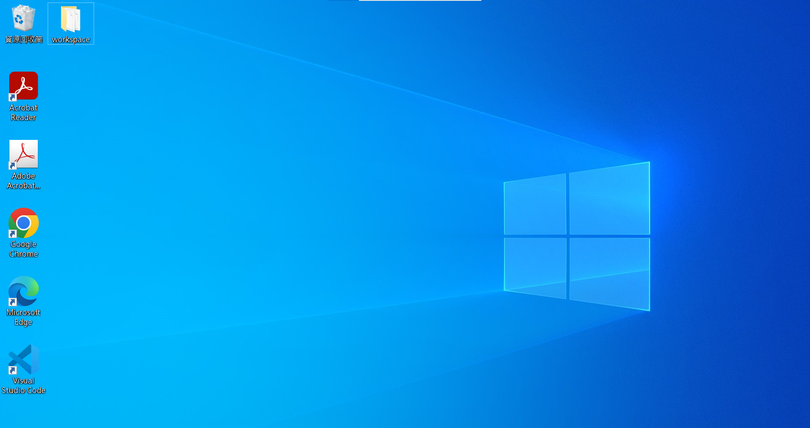
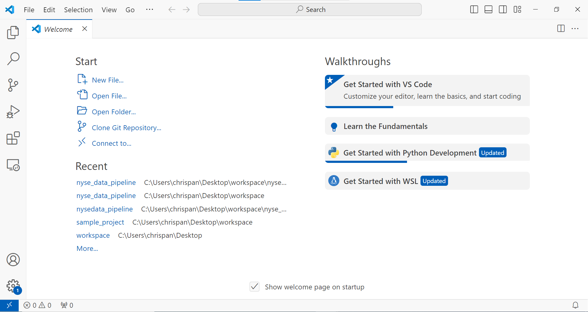
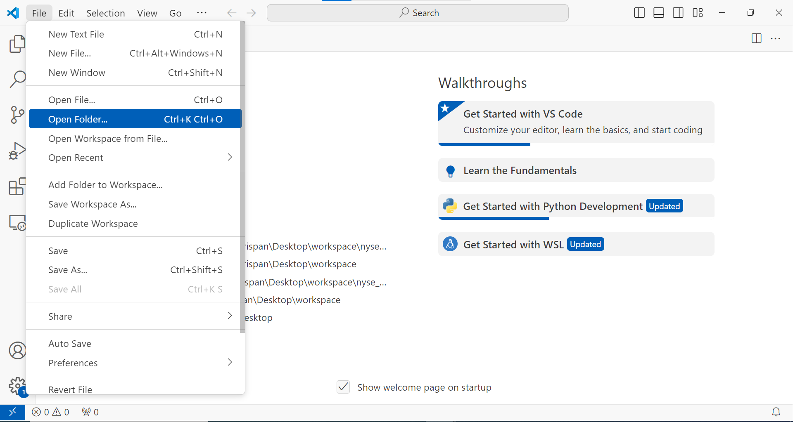
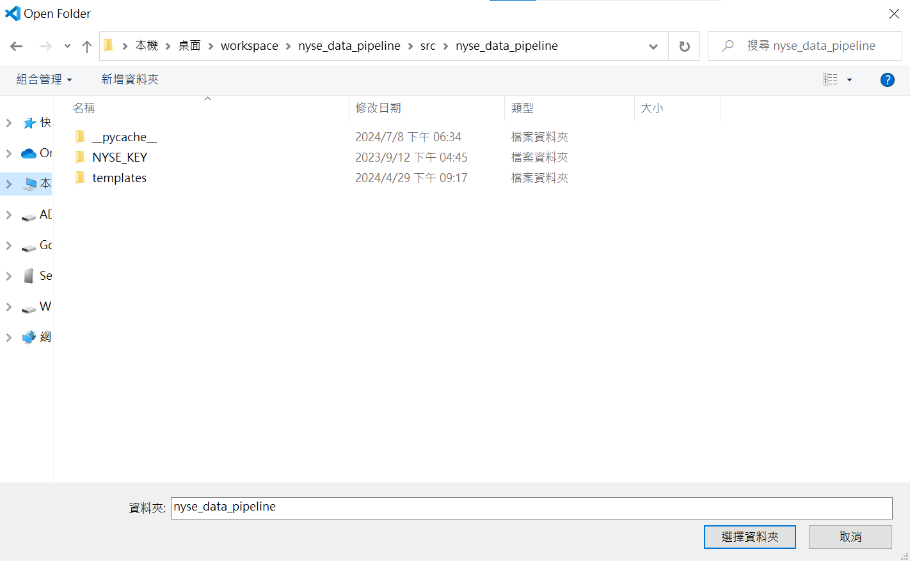
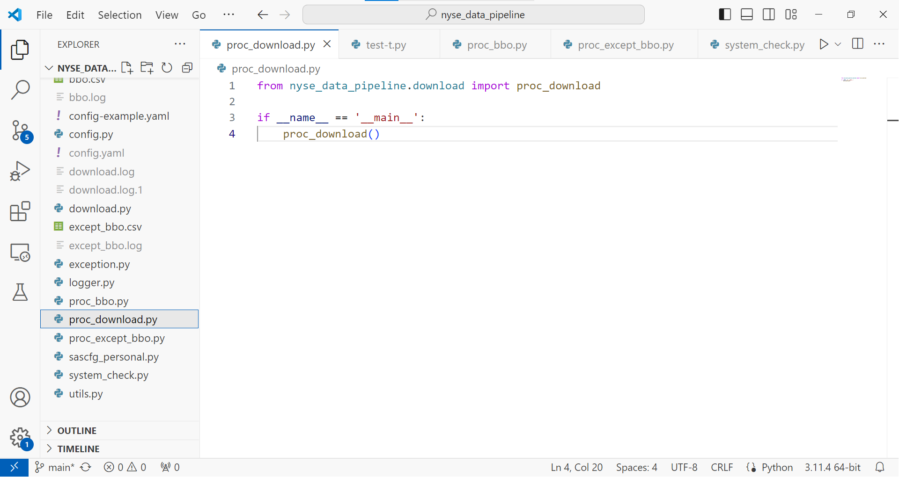
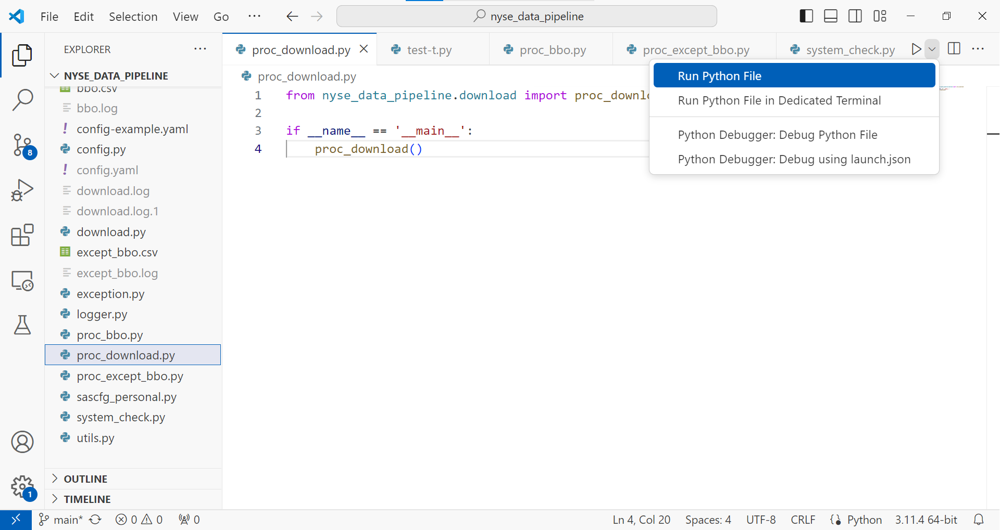
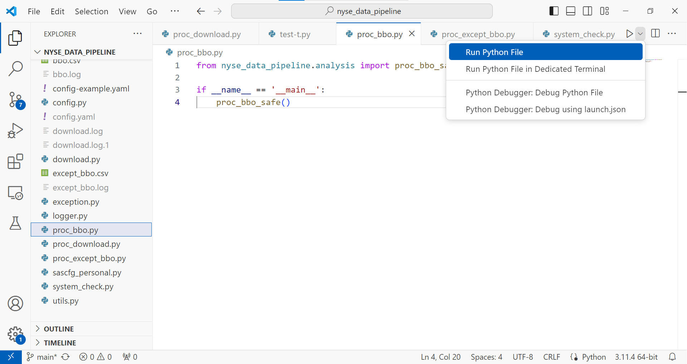
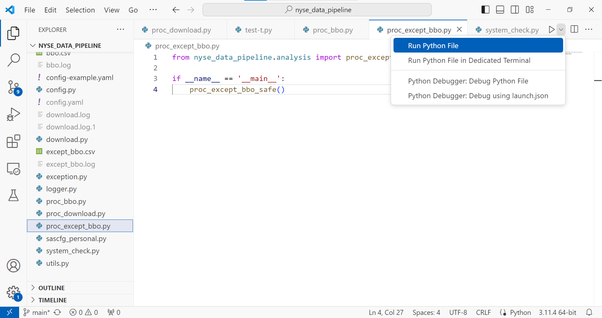

# user guide

## 環境設定

1. 從桌面或是從工作列找到 **Visual Studio Code**，並點擊開啟



 

2. 從最上方工作列找到 **File -> Open Folder**，打開資料夾`C:\Users\chrispan\Desktop\workspace\nyse_data_pipeline\src\nyse_data_pipeline`





3. 點擊視窗左側工作列第一個圖示 **Explore** ( 或按下 **Ctrl+Shift+E** )，列出目前資料夾的所有檔案。



## 運行參數配置

1. 點擊視窗左側工作列第一個圖示 **Explore** ( 或按下 **Ctrl+Shift+E** )，並找到 **config.yaml**

```yaml
sftp: # sftp 設定參數，原則上不用更改
  user: sftp 使用者名稱
  host: sftp.nyse.com
  port: 22
  key_file: private key 放置的路徑
  max_retry: 3 # sftp 連線失敗時重新嘗試的最大次數
download: # 下載任務
  create_dir: True  # True: 自動遞迴創建資料夾 ; False: 不創建資料夾
  safe_to: # 每一個種類的資料存放的根目錄
    EQY_US_ALL_ADMIN: L:\2024\EQY_US_ALL_ADMIN
    EQY_US_ALL_BBO_ADMIN: L:\2024\EQY_US_ALL_BBO_ADMIN
    EQY_US_ALL_NBBO: L:\2024\EQY_US_ALL_NBBO
    EQY_US_ALL_REF_MASTER: L:\2024\EQY_US_ALL_REF_MASTER
    EQY_US_ALL_REF_MASTER_PD: L:\2024\EQY_US_ALL_REF_MASTER_PD
    EQY_US_ALL_TRADE: L:\2024\EQY_US_ALL_TRADE
    EQY_US_ALL_TRADE_ADMIN: L:\2024\EQY_US_ALL_TRADE_ADMIN
    SPLITS_US_ALL_BBO: E:\SPLITS_US_ALL_BBO
  only: # 執行下載任務時，只下載以下種類的資料
    - SPLITS_US_ALL_BBO
    - EQY_US_ALL_ADMIN 
    - EQY_US_ALL_BBO_ADMIN
    - EQY_US_ALL_NBBO
    - EQY_US_ALL_REF_MASTER
    - EQY_US_ALL_TRADE
    - EQY_US_ALL_TRADE_ADMIN
  # 下載資料的日期範圍
  start_year: 2024
  start_month: 7
  end_year: 2024
  end_month: 7
sas: 
  # 資料處理的日期範圍
  start_year: 2024
  start_month: 5
  start_day: 20
  end_year: 2024
  end_month: 5
  end_day: 20
  task:  # 包含 bbo 以及 except bbo 資料處理任務
    bbo: # bbo 資料處理任務
      program: C:\temp\bbo_test.sas # bbo 資料處理程式路徑
      source:  # not used
        - SPLITS_US_ALL_BBO
      result: # 分析結果的存放路徑
        7z: M:\2024cq
    except_bbo: # except bbo 資料處理任務
      program: C:\temp\except_bbo_test.sas # except bbo 資料處理程式路徑
      source: # not used
        - EQY_US_ALL_REF_MASTER
        - EQY_US_ALL_BBO_ADMIN
        - EQY_US_ALL_TRADE_ADMIN
        - EQY_US_ALL_ADMIN
        - EQY_US_ALL_TRADE
        - EQY_US_ALL_NBBO
      result: # 分析結果的存放路徑
        7z: k:\master2024
```

## 下載資料 

1. 點擊視窗左側工作列第一個圖示 **Explore** ( 或按下 **Ctrl+Shift+E** )，並找到 **proc_download.py**

2. 點擊視窗右上角播放鍵 ( 或選擇 Run Python File )，執行 python 檔案，進行下載任務

 

## bbo 資料處理

1. 點擊視窗左側工作列第一個圖示 **Explore** ( 或按下 **Ctrl+Shift+E** )，並找到 **proc_bbo.py**

2. 點擊視窗右上角播放鍵 ( 或選擇 Run Python File )，執行 python 檔案，進行 bbo 資料處理



## except bbo 資料處理

1. 點擊視窗左側工作列第一個圖示 **Explore** ( 或按下 **Ctrl+Shift+E** )，並找到 **proc_except_bbo.py**

2. 點擊視窗右上角播放鍵 ( 或選擇 Run Python File )，執行 python 檔案，進行 except bbo 資料處理。



## 查看 log

- 下載資料的 log 是 `download.log`
- bbo 資料處理的 log 是 `bbo.log`
- except bbo 資料處理的 log 是 `except_bbo.log`

